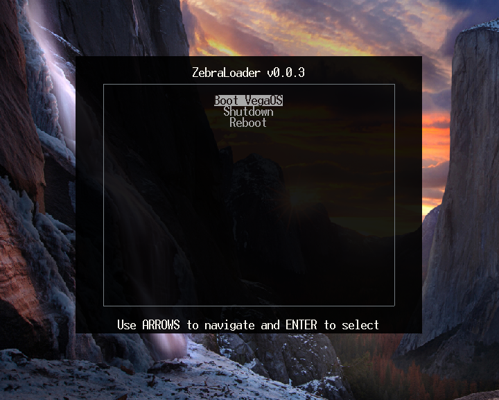

# ZebraLoader

The ZebraLoader is a lightweight bootloader that is designed to facilitate the loading of ELF files and the subsequent initialization of the system for the kernel contained within the loaded ELF.

## Building
Build the cross compiler by executing ``tools/cross.sh``
Use ``make KERNEL_ELF=path/to/kernel/elf OUTPUT_IMG=OSName.img``

## Screenshot

## Note
Kernels must be linked at address 0xC0FFF000
